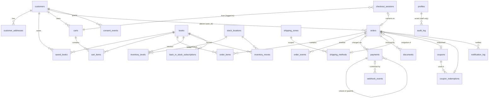

# מודל הנתונים — מערכת המסחר של מכון קרן רא״ם

**גרסה 1.1** · שינויי הסבב: ‏`book_costs` פרטית (עלות יוצאת מ־`books`), ‏`order_items.cost_price_snapshot`, ‏HMAC לסוד־שרת ב־`contact_hash`, ‏`coupons.combinable_with_coupons`, עמודות צמצום ו־retention ל־`webhook_events`, מצב `cancel_pending_refund` בציר ההזמנה, ריבוי מחסנים בתכולה, תכנון migration ‎36. פירוט ב[יומן השינויים](./commerce-changelog.md).

> מסמך זה הוא חלק מחבילת אפיון המסחר. מסמכים נלווים:
> [מסמך האב](./commerce-master-spec.md) · [ניתוח פערים](./commerce-gap-analysis.md) · [תרשימי תהליכים](./commerce-flows.md) · [תוכנית יישום](./commerce-implementation-plan.md) · [החלטות](./commerce-decisions.md) · [מפרט מסכים](./commerce-ui-spec.md)
>
> **סטטוס: אפיון בלבד. migrations ‎23–35 כבר הורצו בסבבי הבנייה; שינויי 1.1 מרוכזים ב־migration ‎36 המתוכנן — אין להריץ אותו לפני אישור.**
> נבדק מול הקוד בענף `claude/keren-raam-ecommerce-spec-6d5t3q` (מכיל את `claude/keren-raam-site-spec-swnrqq` כ־ancestor מלא, בתוספת מיזוגי PR‏ 13–14). תאריך בדיקה: אוגוסט 2026.

---

## 1. מצב קיים — מה יש היום במסד (מאומת מול `supabase/*.sql`)

### 1.1 טבלאות קיימות ורלוונטיות למסחר

| טבלה | קובץ מקור | תפקיד | מצב מסחרי |
|---|---|---|---|
| `books` | `01_schema.sql:148-182` + הרחבות | לב הקטלוג, כולל שדות מסחר רדומים | **קיים, חלקי** — ראו 1.2 |
| `orders` | `01_schema.sql:258-271` | הזמנות (שלב ב׳) | **קיים בסכימה, ריק, ללא קוד TS** |
| `order_items` | `01_schema.sql:273-280` | שורות הזמנה עם צילום | **קיים בסכימה, ריק, ללא קוד TS** |
| `site_settings` | `01_schema.sql:242-251` | הגדרות + `store_enabled` + `extra jsonb` | קיים; `extra` מכיל רק `banners_enabled`, `shelf_book_ids` |
| `profiles` | `01_schema.sql:47-53` | **משתמשי צוות בלבד** (admin/editor/viewer) | קיים; אין מושג לקוח |
| `audit_log` | `01_schema.sql:285-292` | תיעוד פעולות | קיים אך מינימלי: `{user_id, action, table_name, record_id}` בלבד, ללא before/after |
| `page_views` | `18_page_views.sql` | אנליטיקה עצמית | קיים; אין מנגנון retention |
| `series`, `book_relations`, `tags`, `book_tags`, `attributes`… | `08/10/14_*.sql` | שכבת ידע לקטלוג | קיימות ותקינות; משמשות את מנועי ה"קשרים" |

### 1.2 שדות מסחר קיימים על `books` (מאומתים)

| שדה | הגדרה | מקור | הערות |
|---|---|---|---|
| `price` | `numeric(10,2)` nullable | `01_schema.sql:170` | **אין check ≥ 0**; הטופס מקבל גם ערך שלילי (`BookForm.tsx:645`, אין min) |
| `currency` | `text default 'ILS'` | `01_schema.sql:171` | בטופס — שדה **מוסתר** שמחזיר את הערך הקיים בלבד (`BookForm.tsx:83-84`); בסכימת האדמין (`lib/admin/schema.ts:119`) הוא טקסט חופשי ללא enum |
| `sku` | `text unique` | `01_schema.sql:172` | בטופס יושב בלשונית "פרטי יסוד" (`BookForm.tsx:309-315`), לא בלשונית "מסחר"; כפילות SKU מדוּוחת בטעות כשגיאת slug (`actions.ts:344-350`) |
| `stock_quantity` | `int default 0` nullable | `01_schema.sql:173` | שדה ריק בטופס נכתב כ־`null` ולא כ־0 (`schema.ts` משתמש ב־`f()` ולא `fd()`); **אין check ≥ 0** |
| `is_purchasable` | `boolean not null default false` | `01_schema.sql:174` | "ניתן לרכישה באתר" (`BookForm.tsx:678`) |
| `weight_grams` | `int` | `01_schema.sql:175` | "משמש לחישוב משלוח" (`BookForm.tsx:653-660`) |
| `stock_location` | `text` | `22_book_location_size.sql:10` | מיקום פיזי כטקסט חופשי — לצוות בלבד |
| `physical_size` | `text` | `22_book_location_size.sql:11` | מידות |
| `preorder_enabled` | `boolean not null default false` | `14_book_page_v3.sql:41` | מזין את `getBookAvailability` |
| `preorder_release_date` | `date` | `14_book_page_v3.sql:42` | תאריך יציאה משוער |
| `catalogue_number` | `int not null unique` + sequence + trigger | `09_catalogue_numbers.sql` | מספור רץ בלתי־ניתן לעריכה ולא ממוחזר — **התבנית שנאמץ למספרי הזמנה** |

### 1.3 `orders` ו־`order_items` הקיימות — ניתוח

```sql
-- 01_schema.sql:19
create type order_status as enum ('pending','paid','failed','shipped','cancelled','refunded');
```

`orders`: `id, user_id→auth.users (set null), status, total numeric(10,2), currency, payment_ref, shipping_address jsonb, contact_email, contact_phone, notes, created_at, updated_at`.
`order_items`: `id, order_id (cascade), book_id (set null), title_snapshot, quantity check(>0), unit_price`.

**RLS קיים** (`01_schema.sql:393-411`): `orders_own_read` (‏`user_id = auth.uid() or can_edit()`), `orders_insert` (אותו תנאי), `orders_staff_update` (‏`can_edit()`), ומקבילות ל־`order_items`. אין policy ל־delete (נכון — הזמנות לא נמחקות).

**הערכה: ניתן להרחבה, לא להחלפה.** הבסיס נכון (צילום שם ומחיר, RLS לפי בעלים, אינדקסים על `order_id` ו־`user_id`), אבל חסרים בו: ארבעת צירי המצב, מספר הזמנה אנושי, פירוק סכומים, קישור לקוח/אורח מאובטח, שדות מתנה, ערוץ מכירה, idempotency. ששת מצבי ה־enum הקיימים מערבבים שלושה צירים (תשלום/אספקה/חיים) — ראו סעיף 4 למיפוי ההמרה.

**אימות שימוש בקוד:** grep מלא על `src/` — אפס פניות ל־`from('orders')` / `order_items`. ‏`types.ts:8` מגדיר `OrderStatus` אך אין `interface Order`. הטבלאות אינן מופיעות גם ברשימת בדיקות ה־diagnostics (`admin/diagnostics/page.tsx:22`).

### 1.4 ממצאי תשתית קריטיים למודל הנתונים

1. **אין שכבת לקוחות.** `profiles` מוגדרת "משתמשי צוות" (`01_schema.sql:45`), והטריגר `handle_new_user` (`01_schema.sql:56-71`, שוחזר ב־`13_harden_search_path.sql:53-64`) יוצר פרופיל צוות **ללא תנאי** לכל רשומה חדשה ב־`auth.users`, עם `role='viewer'`. מכיוון ש־`requireRole('viewer')` הוא השער של דשבורד הניהול (`(dashboard)/layout.tsx:25`), **לקוח שיירשם דרך אותו pool יקבל גישת קריאה לממשק הניהול.** זהו החסם המבני הראשון שחייב ליפול לפני כל הרשמת לקוחות — ראו migration ‎23.
2. **אין service-role client.** ‏`SUPABASE_SERVICE_ROLE_KEY` מוצהר ב־`.env.example:14` בלבד ואינו נקרא בשום מקום ב־`src/`. פעולות כספיות בצד השרת ידרשו factory חדש (`createServiceClient`) עם משמעת שימוש נוקשה.
3. **`06_restore_grants.sql` מעניק `grant all` + `alter default privileges` ל־anon/authenticated על כל הטבלאות, כולל עתידיות.** משמעות: כל טבלת מסחר חדשה נולדת עם הרשאות טבלה מלאות ל־anon, ורק RLS מגן עליה. לכן **כל migration מסחרי חייב לכלול revoke מפורש** על טבלאות כספיות (הגנה בעומק; ראו תבנית בסעיף 6.3).
4. **המטמון מבוסס ISR בלבד** — `revalidate = 60` בכל העמודים הציבוריים, ו־`revalidatePath` מתועד בקוד עצמו כלא־אמין בסביבה שנמדדה (הערה ב־`books/[slug]/page.tsx:30-41`). מחיר ומלאי בקטלוג יכולים לפגר עד 60 שניות — לכן כל אימות כספי חייב להתבצע מול המסד ברגע האמת, לעולם לא מול ה־HTML המרונדר. בנוסף, `saveStoreSettings` מרענן רק את תבנית עמוד הספר ולא את הקטלוג/הבית (`settings-actions.ts:119-120`) — פער קיים.
5. **`audit_log` נכתב מ־9 נקודות** אבל בלי ערכים ישנים/חדשים; `togglePublished` כלל אינו מתעד. נדרשת הרחבה (migration ‎35).

---

## 2. עקרונות המודל המוצע

1. **מקור אמת יחיד לכל נתון.** מחיר נוכחי — `books`; מחיר בהזמנה — צילום ב־`order_items`; מלאי — `inventory_levels` (עם `books.stock_quantity` כמטמון נגזר לתאימות); מצב תשלום — `orders.payment_state` המוזן אך ורק מ־Webhook/פעולת צוות; מסמך — `documents`; עגלה של מחובר — `carts`; עגלת אורח — localStorage (כמו היום).
2. **תוספות בלבד עד נקודת ה־cutover.** כל ה־migrations עד שלב 4 הם additive (עמודות nullable/עם default, טבלאות חדשות) — הפיכים ע"י drop פשוט, בלי לגעת בקוד הקיים. מחיקת `orders.status` הישן נדחית ל־migration ניקיון נפרד, חודשים אחרי הייצוב.
3. **כתיבה כספית — service role בלבד.** ללקוחות אין policy כתיבה על אף טבלה כספית. `payments`, `webhook_events`, `documents`, `inventory_moves`, `order_events` — insert רק דרך service role; ללקוח קריאה מסוננת בלבד היכן שנדרש.
4. **Idempotency נאכף במסד, לא רק בקוד** — אילוצי unique על מפתחות idempotency, על מזהי עסקה חיצוניים ועל צירופי (order, book, move_type).
5. **אין מחיקה של רשומות כספיות.** ביטול = מעבר מצב + רשומת ציר זמן. `on delete restrict` על קשרים כספיים.
6. **עקיבות בתבניות קיימות:** מספור רץ בתבנית `09_catalogue_numbers.sql`; קשיחות `search_path = public, pg_temp` לכל פונקציה חדשה בתבנית `13_harden_search_path.sql`; RLS בתבנית שלוש השכבות של `18_page_views.sql`.

---

## 3. טבלאות חדשות ומורחבות — מפרט מלא

הסימון: 🆕 טבלה חדשה · 🔧 הרחבת טבלה קיימת. טיפוסי כסף: `numeric(10,2)` (עקבי עם הקיים). כל הטבלאות עם `created_at/updated_at` + trigger ‏`set_updated_at` הקיים אלא אם צוין אחרת.

### 3.1 🆕 `store_settings` — הגדרות חנות ודגלים שכבתיים

שורה יחידה (`id=1 check`), בתבנית `site_settings`. ‏`site_settings.store_enabled` נשאר **מתג־העל** (semantics קיימים נשמרים); הדגלים כאן מדליקים שכבות תחתיו.

| שדה | טיפוס | ברירת מחדל | הערות |
|---|---|---|---|
| `id` | `int pk check(id=1)` | 1 | |
| **דגלים** | | | |
| `show_prices` | boolean | false | הצגת מחירים בקטלוג ובעמוד ספר |
| `cart_enabled` | boolean | false | עגלה + Mini Cart |
| `checkout_enabled` | boolean | false | טופס Checkout (עד יצירת הזמנה) |
| `payments_enabled` | boolean | false | מעבר לסליקת מורנינג |
| `express_checkout_enabled` | boolean | false | Bit / Apple Pay / Google Pay (כפוף לאימות 9.3.1) |
| `coupons_enabled` | boolean | false | |
| `accounts_enabled` | boolean | false | OTP, אזור אישי, חשבון פסיבי |
| `returns_enabled` | boolean | false | בקשות ביטול/החזרה בשירות עצמי |
| `recommendations_enabled` | boolean | false | "נקנו יחד" וכד׳ |
| `donations_enabled` | boolean | false | תוספת תרומה (כפוף לאימות 9.3.5) |
| **תצורה** | | | |
| `free_shipping_threshold` | numeric(10,2) null | null | null = אין משלוח חינם |
| `installments_min_total` | numeric(10,2) | 250 | סף תשלומים (החלטה 19) |
| `installments_max` | int | 3 | מקסימום תשלומים |
| `vat_mode` | text check in ('exempt','included') | 'included' | ראו החלטה 20/הרחבת קטלוג; "המחירים כוללים מע״מ" היום הוא טקסט חופשי בלבד (`BookForm.tsx:639`) |
| `vat_rate` | numeric(5,2) | 18.00 | רלוונטי רק כש־`vat_mode='included'` |
| `document_type` | text | 'invoice_receipt' | סוג המסמך במורנינג (החלטה 3) |
| `order_prep_days` | int | 1 | זמן הכנה להזמנה (עסק ימים) |
| `delivery_buffer_days` | int | 1 | מרווח ביטחון לחישוב תאריך |
| `non_working_dates` | jsonb | '[]' | לוח חופשות/ערבי חג — מערך תאריכים/טווחים |
| `pickup_enabled` | boolean | true | |
| `pickup_address` | jsonb | '{}' | כתובת, הוראות הגעה |
| `pickup_hours` | text null | | שעות איסוף |
| `pickup_prep_hours` | int | 24 | זמן הכנה לאיסוף |
| `support_phone` | text null | | הטלפון של "מעדיפים להזמין בטלפון?" (נפרד מ־`site_settings.contact.phone` אם יידרש) |
| `low_stock_threshold` | int | 2 | סף התראה ברמת החנות (לספר — שדה פר־ספר, 3.2) |
| `guest_link_ttl_days` | int | 90 | תוקף קישור הזמנת אורח |
| `abandoned_after_minutes` | int | 60 | מתי Checkout נחשב נטוש |
| `abandoned_retention_days` | int | 90 | כמה זמן נשמר (החלטה 15) |
| `add_to_order_window_hours` | int | 12 | חלון "הוסף להזמנה" (החלטה 22) |

RLS: קריאה ציבורית (`using (true)` — אין כאן סוד, והצד הציבורי זקוק לסף משלוח חינם ולטלפון); כתיבה `is_admin()`. אין צורך ב־service role.

### 3.2 🔧 `books` — הרחבות קטלוג למסחר (migration ‎26)

| שדה חדש | טיפוס | הערות |
|---|---|---|
| `sale_price` | numeric(10,2) null, check(`sale_price is null or sale_price >= 0`) | מחיר מבצע |
| `sale_starts_at`, `sale_ends_at` | timestamptz null | חלון מבצע |
| `sale_name_he`, `sale_name_en` | text null | שם המבצע |
| `compare_at_price` | numeric(10,2) null | מחיר השוואה (מומלץ־עתידי) |
| ~~`cost_price`~~ | — | **[1.1] הוסר מ־`books` במכוון** (וכך גם נבנה migration ‎26 בפועל): ‏RLS ב־Supabase אינו ברמת עמודה, ו־`books` נקראת ציבורית — עלות בעמודה כאן הייתה דולפת. העלות יושבת בטבלה פרטית `book_costs` (סעיף 3.18) |
| `tax_group` | text default 'standard' | 'standard'/'exempt' — הסדרת שדה המע״מ |
| `is_stock_managed` | boolean not null default true | false = מלאי בלתי מוגבל (למשל קובץ) |
| `low_stock_threshold` | int null | דריסה פר־ספר של הסף בהגדרות |
| `allow_backorder` | boolean not null default false | רק אם יוחלט (החלטה 10) |
| `barcode` | text null | ברקוד נפרד מ־ISBN/מק״ט |
| `prep_days_override` | int null | זמן הכנה חריג לספר (מזין תאריך אספקה) |
| `free_shipping_eligible` | boolean not null default true | זכאות למשלוח חינם |
| `coupons_excluded` | boolean not null default false | החרגה מקופונים |

בנוסף — **אילוצי הגנה על שדות קיימים** (באותו migration, עם תיקון דאטה לפניהם):
`check (price is null or price >= 0)`, ‏`check (stock_quantity is null or stock_quantity >= 0)`, ‏`check (weight_grams is null or weight_grams >= 0)`.
הערה: `stock_quantity` הופך בהמשך (migration ‎30) למטמון נגזר מ־`inventory_levels`; עד אז הוא נשאר מקור האמת ואין שינוי בקוד הקיים.

### 3.3 🆕 `customers` + הפרדת לקוחות (migrations ‎23, ‎25)

**עיקרון:** לקוחות חיים באותו `auth.users` (כדי לקבל OTP של Supabase בחינם) אך **לעולם אינם מקבלים שורת `profiles`**. ‏`current_user_role()` מחזירה null בהיעדר שורה ⇒ `can_edit()`/`is_admin()` שקרי ⇒ כל RLS הצוות חסום; `requireRole` מפיל אותם ב־`no-profile` (מצב שכבר קיים ומטופל ב־`auth.ts:21-33` ובעמוד הלוגין). ההפרדה נאכפת בשלוש שכבות: הטריגר, ה־RLS, וה־UI.

**migration ‎23 — תנאי בטריגר:**
```sql
-- handle_new_user: יצירת פרופיל צוות רק כשהמשתמש סומן כצוות במפורש
create or replace function public.handle_new_user() ... as $$
begin
  if coalesce(new.raw_app_meta_data->>'kr_staff', '') = 'true' then
    insert into public.profiles (id, full_name)
    values (new.id, new.raw_user_meta_data->>'full_name');
  end if;
  return new;
end $$;
```
`raw_app_meta_data` (ולא `user_meta_data`) — כי app_metadata נכתב רק בצד שרת/דשבורד ואינו ניתן לזיוף מהלקוח. **השלכה תפעולית:** הוספת איש צוות חדש דרך דשבורד Supabase תחייב הוספת `{"kr_staff":"true"}` ל־app_metadata (יעודכן ב־README וב־`05_repair_profiles.sql`). Rollback: החזרת הפונקציה מ־`13_harden_search_path.sql:53-64`.

**`customers`:**

| שדה | טיפוס | הערות |
|---|---|---|
| `id` | uuid pk references auth.users(id) on delete cascade | אותו מזהה כמו auth |
| `phone` | text unique not null | E.164; מזהה ראשי (טלפון־תחילה) |
| `email` | text null | חובה בהזמנה, לא בהכרח בחשבון |
| `full_name` | text null | |
| `default_address_id` | uuid null (fk מוגדר אחרי `customer_addresses`) | |
| `marketing_email_opt_in` | boolean not null default false | opt-in נפרד (סעיף 4 במדיניות הפרטיות) |
| `channel_sms_opt_in` | boolean not null default false | החלטה 23 — ריק כברירת מחדל |
| `channel_whatsapp_opt_in` | boolean not null default false | |
| `locale` | text default 'he' | |
| `created_at/updated_at` | timestamptz | |

RLS: ‏select/update ללקוח על שורתו (`id = auth.uid()`), **בלי** policy ל־insert מהלקוח (יצירה — service role בתהליך החשבון הפסיבי/OTP); צוות: select לפי הרשאת "ניהול לקוחות" (בשלב ראשון `can_edit()`), עדכון admin בלבד. עמודת `role` — **אין**: היעדר שורת profiles הוא ההגדרה של "לקוח".

**🆕 `customer_addresses`:** `id, customer_id (cascade), label, recipient_name, phone, city, street, house_number, entrance, floor, apartment, zip, courier_notes, is_default boolean, created_at/updated_at`. RLS: בעלים מלא (select/insert/update/delete `customer_id = auth.uid()`), צוות select. אינדקס `(customer_id)`. אילוץ: `unique (customer_id) where is_default` — partial unique index לכתובת ברירת מחדל אחת.

**🆕 `saved_books` — סנכרון מועדפים ומדף (שיקוף מבנה ה־localStorage הקיים):**
`customer_id, book_id, is_favourite boolean not null default false, shelf text null check (shelf in ('wantToRead','wantToBuy','owned','wantAsGift')), created_at, updated_at, pk(customer_id, book_id)`.
ערכי `shelf` זהים למפתחות `ShelfPicker.tsx:7-12`; המיזוג בהתחברות פשוט (union). רשימות בשם חופשי/שיתוף — טבלת `customer_lists` עתידית (שלב מתקדם, לא ב־MVP).

**🆕 `consent_events` — תיעוד הסכמות:** `id, customer_id null, email null, phone null, kind text ('marketing_email','channel_sms','channel_whatsapp','terms'), granted boolean, source text ('checkout','account','thank_you','unsubscribe_link','staff'), order_id null, created_at`. Insert: service role + בעלים; select: צוות. לעולם לא נמחק.

### 3.4 🆕 `carts` + `cart_items` (migration ‎31)

| `carts` | | `cart_items` | |
|---|---|---|---|
| `id` uuid pk | | `id` uuid pk | |
| `customer_id` uuid null → customers (cascade) | | `cart_id` → carts (cascade) | |
| `status` text check in ('active','merged','converted','expired') default 'active' | | `book_id` → books (**restrict**) | |
| `currency` text default 'ILS' | | `quantity` int check (>0 and <=99) | |
| `expires_at` timestamptz null | | `added_at` timestamptz | |
| `created_at/updated_at` | | unique(`cart_id`,`book_id`) | |

- **אורח: העגלה נשארת ב־localStorage** (מפתח חדש `kr:cart`, באותה תבנית `useLocalMap` של `client-hooks.ts` — bookId→quantity). אין רשומת עגלה אנונימית במסד ב־MVP (פחות PII, פחות זבל; ראו החלטה בסעיף 7.1 במסמך האב).
- מחובר: עגלה שרתית אחת `active` לכל לקוח (partial unique index: `unique(customer_id) where status='active'`).
- מיזוג בהתחברות: union; כמות = המקסימום משתי הגרסאות (לא סכום — מניעת הכפלה בטעות). העגלה המקומית מרוקנת לאחר מיזוג מוצלח.
- RLS: בעלים מלא על שלו (דרך join ל־carts ב־cart_items); צוות select (תמיכה).
- אין צילום מחיר בעגלה — המחיר נקרא חי מ־books בכל רינדור ומאומת שוב בשרת; הצילום נעשה רק ביצירת ההזמנה.

### 3.5 🆕 `checkout_sessions` (migration ‎31)

מזהה התקדמות, בסיס עגלות נטושות ועוגן idempotency לפני שקיימת הזמנה.

| שדה | טיפוס | הערות |
|---|---|---|
| `id` | uuid pk | נשלח לדפדפן כ־cookie httpOnly / שדה מוסתר |
| `customer_id` | uuid null | |
| `status` | text check in ('open','contact_entered','abandoned','converted','expired') | |
| `items` | jsonb not null | ‏[{book_id, quantity}] — צילום קל, לא כספי |
| `contact_phone`, `contact_name`, `contact_email` | text null | נשמרים אחרי בלוק 1 |
| `fulfillment` | jsonb | ‏{type:'shipping'/'pickup', method_id, address{…}, courier_notes} |
| `is_gift`, `gift_recipient_name`, `gift_message`, `gift_hide_prices` | — | בלוק 3 |
| `coupon_code` | text null | |
| `donation_amount` | numeric(10,2) null | |
| `is_express` | boolean default false | + `express_wallet` text null ('bit','apple_pay','google_pay') |
| `notify_channel` | text null check in ('sms','whatsapp') | הסכמת ערוץ נייד (ריק כברירת מחדל) |
| `idempotency_key` | text unique not null | נוצר בלקוח פעם אחת לכל session |
| `order_id` | uuid null → orders | מולא בהמרה; מפתח ה־idempotency האמיתי |
| `locale` | text | |
| `abandoned_email_sent_at` | timestamptz null | מניעת מייל שחזור כפול |
| `expires_at`, `created_at/updated_at` | | ניקוי לפי `abandoned_retention_days` |

RLS: **אין policy ללקוח כלל** — כל הגישה דרך Server Actions עם service role (ה־id עצמו הוא bearer; אין לחשוף אותו ב־RLS למשתמשים אחרים). צוות: select (דוח נטישה).

### 3.6 🔧 `orders` — הרחבה (migration ‎27)

**enums חדשים** (שמות חדשים; ה־`order_status` הישן לא נמחק בשלב זה):

```sql
create type order_state       as enum ('draft','pending','confirmed','processing','completed','cancelled','closed');
create type payment_state     as enum ('not_required','pending','authorized','paid','failed','partially_refunded','refunded','cancelled');
create type fulfillment_state as enum ('unfulfilled','preparing','ready_for_pickup','partially_fulfilled','fulfilled','shipped','delivered','returned');
create type document_state    as enum ('not_created','pending','created','failed','cancelled','credited');
```

**עמודות חדשות על `orders`:**

| קבוצה | שדות |
|---|---|
| זיהוי | `order_number bigint unique` (sequence + trigger בתבנית `keep_catalogue_number`, ‏`setval` התחלתי 1000); `channel text check in ('web','phone','manual') default 'web'`; `locale text default 'he'` |
| צירי מצב | `state order_state default 'draft'`, `payment_state payment_state default 'pending'`, `fulfillment_state fulfillment_state default 'unfulfilled'`, `document_state document_state default 'not_created'` |
| סכומים (צילום) | `subtotal`, `discount_total`, `shipping_total`, `donation_amount`, `tax_total`, — כולם `numeric(10,2) not null default 0`; `total` הקיים נשאר הסכום הסופי; `check (total >= 0)` |
| קופון | `coupon_id uuid null → coupons (set null)`, `coupon_code_snapshot text null` |
| אספקה (צילום) | `fulfillment_type text check in ('shipping','pickup') default 'shipping'`, `shipping_method_id uuid null (set null)`, `shipping_method_name_snapshot text`, `promised_delivery_date date null`, `shipping_address jsonb` (קיים; מבנה מוגדר בסעיף 3.3), `courier_notes text` |
| מתנה | `is_gift boolean default false`, `gift_recipient_name text`, `gift_message text`, `gift_hide_prices boolean default true` |
| גישת אורח | `guest_token_hash text null unique`, `guest_token_expires_at timestamptz`, `guest_token_revoked boolean default false` — **נשמר hash (sha256) בלבד**, הטוקן הגולמי נשלח במייל ולא נשמר |
| מעקב | `placed_at`, `paid_at`, `cancelled_at`, `completed_at` — timestamptz null; `internal_notes text` (צוות); `tags text[] default '{}'` |
| Idempotency | `idempotency_key text unique null` (מועתק מ־checkout_session) |
| תרומה/מטבע | `currency` קיים; `donation_amount` לעיל — נספר בנפרד בדוחות |

**Backfill** מה־enum הישן (בטרנזקציה אחת, שמרני):

| `status` ישן | `state` | `payment_state` | `fulfillment_state` | `document_state` |
|---|---|---|---|---|
| pending | pending | pending | unfulfilled | not_created |
| paid | processing | paid | unfulfilled | not_created* |
| failed | pending | failed | unfulfilled | not_created |
| shipped | processing | paid | shipped | not_created* |
| cancelled | cancelled | cancelled | unfulfilled | not_created |
| refunded | closed | refunded | unfulfilled | not_created* |

\* הטבלאות ריקות בפועל (אומת), כך שה־backfill הוא פורמלי; אם יימצאו רשומות — יסומנו ידנית.

**`orders.status` הישן:** נשאר, מוזן ע"י trigger סנכרון לאחור (מיפוי מ־4 הצירים לערך המקורב) עד migration הניקיון — כדי שכלי חוץ שאולי קוראים אותו לא יישברו. Rollback: ‏drop לעמודות החדשות בלבד.

**מעברי מצב מותרים** — נאכפים בשכבת ה־Domain (‏`src/lib/commerce/orders.ts`) + trigger אימות במסד שמפיל מעבר לא־חוקי; הטבלה המלאה של המעברים, מי רשאי ומה מתועד — במסמך [התרשימים](./commerce-flows.md#state-machines).

### 3.7 🔧 `order_items` — הרחבה (migration ‎27)

| שדה חדש | טיפוס | הערות |
|---|---|---|
| `sku_snapshot` | text null | |
| `unit_price_original` | numeric(10,2) null | מחיר לפני הנחה; `unit_price` הקיים = בפועל |
| `discount_amount` | numeric(10,2) not null default 0 | ברמת שורה |
| `tax_rate_snapshot` | numeric(5,2) null | שיעור המס בעת הרכישה |
| `line_total` | numeric(10,2) | ‏`unit_price*quantity - discount` — נשמר מפורשות (לא מחושב) לצורך התאמה חשבונאית |
| `is_preorder` | boolean default false | הוזמן כהזמנה מוקדמת |
| `cost_price_snapshot` | numeric(10,2) null | **[1.1, migration ‎36]** צילום עלות הפריט מ־`book_costs` בעת יצירת ההזמנה — בסיס דוחות הרווחיות (פרק 17.14 במסמך האב). ‏null = "ללא עלות מתועדת" (נספר בנפרד בדוח, לא כרווח מלא). לעולם אינו נשלח לצד לקוח — נחשף רק בשאילתות צוות בהרשאת עלויות |

אילוץ נוסף: `check (unit_price >= 0)`.

### 3.8 🆕 `order_events` — ציר זמן (migration ‎28)

`id, order_id → orders (cascade), event_type text not null, data jsonb default '{}', actor_type text check in ('customer','staff','system','morning','shipping_provider'), actor_id uuid null, actor_label text, created_at`.
דוגמאות `event_type`: ‏`order_created`, `payment_started`, `payment_succeeded`, `payment_failed`, `webhook_received`, `document_created`, `document_failed`, `stock_reserved`, `stock_committed`, `stock_released`, `status_changed`, `address_updated`, `note_added`, `email_sent`, `sms_sent`, `tracking_added`, `cancel_requested`, `cancelled`, `refund_issued`, `return_requested`, `item_added_post_purchase`.
RLS: insert — service role + צוות (`can_edit()`); select — צוות; ללקוח מוצגת גרסה מסוננת דרך שכבת השרת (לא RLS ישיר). אינדקס `(order_id, created_at)`. אין update/delete — append-only.

### 3.9 🆕 `payments` (migration ‎29)

| שדה | טיפוס | הערות |
|---|---|---|
| `id` | uuid pk | |
| `order_id` | uuid → orders (**restrict**) | |
| `kind` | text check in ('charge','refund') | |
| `parent_payment_id` | uuid null → payments | לזיכוי — החיוב המקורי |
| `provider` | text default 'morning' | |
| `method` | text null check in ('credit','bit','apple_pay','google_pay','manual_external') | ידוע מראש באקספרס; אחרת מתעדכן מה־Webhook |
| `amount`, `currency` | numeric(10,2), text | `check (amount > 0)` |
| `installments` | int default 1 | `check (installments >= 1)` |
| `status` | text check in ('initiated','pending','succeeded','failed','cancelled','expired') | |
| `morning_transaction_id` | text null **unique** | עוגן ההתאמה מול מורנינג |
| `morning_payment_page_url` | text null | דף התשלום שנוצר |
| `morning_payload` | jsonb null | תשובת ה־API בעת היצירה |
| `idempotency_key` | text unique not null | מפתח יצירת דף התשלום |
| `error` | jsonb null | קוד+הודעה בכשל |
| `expires_at` | timestamptz null | תוקף דף תשלום |
| `created_at/updated_at` | | |

אילוץ זיכויים: ‏trigger שמוודא `sum(refunds.amount) <= charge.amount` לפני insert של refund (מניעת זיכוי־יתר — סעיף 14.4).
RLS: **אין גישת לקוח בכלל**; צוות select; כתיבה service role בלבד (revoke insert/update מ־authenticated). ללקוח מוצג רק נגזר ("שולם בביט") דרך שכבת השרת.

### 3.10 🆕 `webhook_events` (migration ‎29)

`id, provider text default 'morning', event_type text null, external_event_id text null, dedupe_hash text not null, signature_valid boolean not null, payload jsonb not null, received_at timestamptz default now(), processing_status text check in ('received','processed','duplicate','invalid_signature','failed') default 'received', processed_at timestamptz null, attempts int default 0, error text null, order_id uuid null, payment_id uuid null`.

- ‏`unique (provider, external_event_id)` כשהספק מספק מזהה; ‏`unique (provider, dedupe_hash)` כגיבוי (hash על גוף האירוע המנורמל). שני האילוצים יחד = **Idempotency ברמת המסד**: אירוע כפול נופל על conflict ומסומן `duplicate` בלי לעבד.
- ‏Payload גולמי נשמר תמיד — גם כשהחתימה נכשלה (לצורך חקירה), עם `signature_valid=false` ו־`processing_status='invalid_signature'`.
- RLS: אפס גישה ל־anon/authenticated (revoke מלא); admin select דרך שכבת השרת בלבד. הנתיב הכותב הוא Route Handler ‏`/api/webhooks/morning` עם service role — **מחוץ ל־matcher של ה־proxy** (`proxy.ts:84` מחריג `api`), ולכן חייב אימות עצמאי מלא (חתימה/סוד בכתובת + אימות סכום מול המסד).

**[1.1, migration ‎36] מדיניות שמירת Payload (סעיף 8 בסבב התיקונים — פרק 8.6 במסמך האב):** עמודות חדשות ושינויי התנהגות:

| תוספת | פירוט |
|---|---|
| תקרת גודל | גוף מעל **256KB** אינו נשמר גולמי — נשמרים hash, אורך ו־headers בלבד + התראה (`payload_truncated=true`) |
| `payload_normalized` jsonb | השדות העסקיים המנורמלים שחולצו (מזהה עסקה, סכום, מטבע, סטטוס, מזהה מסמך, אמצעי) — שורדים גם אחרי טיהור הגולמי |
| צמצום (redaction) | לפני השמירה מוסרים מה־payload שדות רגישים שאינם נחוצים לעיבוד (פרטי לקוח מלאים, כתובות, כל שדה אמצעי־תשלום מעבר ל"מסתיים ב־") — ‏`dedupe_hash` מחושב **לפני** הצמצום כדי שה־idempotency לא יישבר |
| `raw_purged_at` timestamptz | ‏job התחזוקה מרוקן את `payload` הגולמי (משאיר `payload_normalized`) לאירועים מעובדים בני **90 יום** ומעלה; אירועי `failed`/חקירה פתוחה מוחרגים עד סגירתם |
| חתימה שגויה | אירועי `invalid_signature` **אינם** שומרים payload גולמי מלא (ערוץ הצפה זול): נשמרים hash, אורך, מקור (IP/headers) וזמן בלבד |

האחסון פרטי ממילא (RLS אפס־גישה + הצפנה at-rest של Supabase); אין שום נתיב שמציג payload גולמי ל־UI.

### 3.11 🆕 `documents` (migration ‎29)

`id, order_id → orders (restrict), payment_id uuid null, provider text default 'morning', morning_doc_id text null unique, doc_type text check in ('invoice_receipt','receipt','donation_receipt','credit_note'), doc_number text null, issued_at timestamptz null, amount numeric(10,2), currency text, status text check in ('pending','created','failed','cancelled') default 'pending', download_url text null, url_expires_at timestamptz null, storage_path text null, error text null, attempts int default 0, last_attempt_at timestamptz null, idempotency_key text unique, created_at/updated_at`.

- `storage_path` — עותק PDF ב־bucket **פרטי** חדש `documents` (בתבנית ה־bucket הפרטי של `20_contact_attachments.sql`), מוגש ללקוח דרך `createSignedUrls` בלבד (תבנית קיימת ב־`queries.ts:399`). האם מותר/נדרש לשמור עותק — תלוי באימות מורנינג 9.3.8; עד אז `download_url + url_expires_at` הם מקור ההצגה, עם ריענון יזום כשהקישור פג.
- ‏`unique(order_id, doc_type) where status in ('pending','created')` — partial index שמונע שני מסמכים חיים מאותו סוג להזמנה = **מניעת מסמך כפול במסד**.
- RLS: לקוח — select על מסמכי הזמנותיו (join דרך orders על `user_id = auth.uid()`), ורק שדות מוצגים דרך view/שכבת שרת; צוות select; כתיבה service role.

### 3.12 🆕 מלאי: `stock_locations`, `inventory_levels`, `inventory_moves` (migration ‎30)

**`stock_locations`:** `id, slug unique, name text, kind text check in ('warehouse','office','pickup_point','distributor','temp'), is_default boolean default false (partial unique where is_default), active boolean default true, sort_order int`. זריעה: מיקום יחיד `main` (‏is_default). הערה: `books.stock_location` הקיים (טקסט חופשי "מדף A3") הוא **מיקום מדף בתוך המחסן** ואינו מוחלף — נשאר כשדה תפעולי לליקוט.

**[1.1] ריבוי מחסנים — בתכולה, לא עתידי.** הכרעת בעל האתר (החלטה 9): "יש לנו כמה מחסנים". המודל תומך בכך מיסודו (level פר `(book_id, location_id)`, ‏`transfer_in`/`transfer_out`); מה שעולה מהחלטה זו לסבב בנייה 1.1: מסך ניהול מיקומים (הוספה/עריכה, לא רק `main`), בחירת מיקום בפעולות קליטה/ספירה/העברה ב־UI המלאי, ושיוך שמירות (reserve) למיקום ברירת המחדל עם אפשרות העברה בליקוט. שורת ההזמנה מציינת מאיזה מיקום לוקטה (‏`inventory_moves.location_id` כבר קיים).

**`inventory_levels`:** `book_id → books (cascade), location_id → stock_locations (restrict), on_hand int not null default 0 check (>=0), reserved int not null default 0 check (>=0), check (reserved <= on_hand), pk (book_id, location_id)`. ‏`available` אינו נשמר — נגזר (`on_hand - reserved`) ב־view ‏`inventory_available`.

**`inventory_moves` (Ledger, append-only):** `id, book_id, location_id, move_type text check in ('receive','sale','cancel_restock','return_restock','damage','manual_adjust','transfer_in','transfer_out','count','reserve','release'), quantity_delta int not null check (<>0), on_hand_before int, on_hand_after int, reserved_before int, reserved_after int, reason text, order_id uuid null, order_item_id uuid null, actor_type, actor_id, note text, idempotency_key text null, created_at`.
‏Idempotency: ‏`unique (order_id, book_id, move_type) where move_type in ('reserve','sale','release')` — הפחתה כפולה מאותה הזמנה בלתי אפשרית ברמת המסד.

**פונקציות אטומיות (SECURITY DEFINER, ‏`search_path = public, pg_temp`, ‏execute ל־service_role בלבד — revoke מ־anon/authenticated):**
- `commerce_reserve_stock(p_book uuid, p_qty int, p_order uuid)` — ‏`select … for update` על שורת ה־level, בדיקת `available >= p_qty`, עדכון `reserved`, רישום move, עדכון מטמון `books.stock_quantity`. מחזירה הצלחה/כשל מפורט.
- `commerce_commit_stock(...)` — המרת reserve למכירה (`on_hand -= qty, reserved -= qty`).
- `commerce_release_stock(...)` — שחרור שמירה (תשלום נכשל/פג).
- `commerce_restock(...)` — החזרה למלאי (מפורש בלבד, סעיף 11.8).

**סנכרון המטמון:** trigger על `inventory_levels` מעדכן `books.stock_quantity = sum(on_hand - reserved)` (הזמין למכירה) — כך `getBookAvailability` (‏`availability.ts:16`) והקטלוג ממשיכים לעבוד ללא שינוי קוד. **Backfill:** ‏insert ל־levels מ־`books.stock_quantity` הקיים במיקום ברירת המחדל. **Rollback:** ‏drop לטבלאות ולטריגר — `books.stock_quantity` חוזר להיות מקור האמת עם הערכים האחרונים שסונכרנו.

### 3.13 🆕 משלוחים: `shipping_zones`, `shipping_methods` (migration ‎32)

**`shipping_zones`:** `id, name, kind text check in ('include','exclude'), cities text[], notes, active`. שלב ראשון: אזור יחיד "ישראל" + אזור החרגה ריק.

**`shipping_methods`:**

| שדה | טיפוס | הערות |
|---|---|---|
| `id`, `slug unique` | | |
| `name_he`, `name_en`, `description_he`, `description_en` | text | |
| `kind` | text check in ('pickup','flat','by_weight','by_total','free_over') | 'zone' דרך `zone_id` |
| `price` | numeric(10,2) not null default 0 | check ≥ 0 |
| `free_over` | numeric(10,2) null | דריסת סף פר־שיטה |
| `min_weight_grams`, `max_weight_grams` | int null | |
| `min_total`, `max_total` | numeric null | |
| `zone_id` | uuid null → shipping_zones | |
| `eta_business_days` | int not null default 3 | מזין את חישוב תאריך האספקה |
| `price_includes_vat` | boolean default true | |
| `valid_from`, `valid_until` | date null | |
| `active` | boolean default true | |
| `sort_order` | int | |

RLS: קריאה ציבורית (שיטות פעילות בלבד דרך policy ‏`active or can_edit()`), כתיבה admin. זריעה: `pickup` (0 ₪) + `flat`.

### 3.14 🆕 קופונים: `coupons`, `coupon_redemptions` (migration ‎33)

**`coupons`:** `id, code text unique (נשמר uppercase; אימות case-insensitive), kind text check in ('percent','fixed','free_shipping'), value numeric(10,2) check (kind='free_shipping' or value > 0; percent<=100), min_total numeric null, starts_at/ends_at, max_uses int null, max_uses_per_customer int default 1, first_order_only boolean default false, applies_to jsonb default '{}' ({book_ids[], category_ids[], author_ids[], exclude_book_ids[]}), combinable_with_sale boolean default false, **[1.1, migration ‎36]** combinable_with_coupons boolean not null default false, active boolean default true, created_by uuid, created_at/updated_at`.

**[1.1] צבירת קופונים (דרישת בעל האתר):** שדה `combinable_with_coupons` — ברירת מחדל **לא** ניתן לצבירה. הזנת קופון שני על הזמנה שיש בה קופון: אם אחד מהשניים אינו צביר — נחסם עם הודעה ("לא ניתן לשלב עם קופון קיים — הקופון הקודם יוסר אם תאשר"); אם שניהם צבירים — שניהם חלים, שורת הנחה לכל אחד, סדר חישוב: אחוז לפני סכום קבוע. הקופון חל **כבר בעגלה** (פרק 12 במסמך האב + מסך העגלה במפרט המסכים) — לא רק ב־Checkout.

**`coupon_redemptions`:** `id, coupon_id → coupons (restrict), order_id → orders unique, customer_id null, contact_hash text, amount_discounted numeric(10,2), created_at`. ‏unique(coupon_id, order_id).

**[1.1] ‏`contact_hash` = ‏HMAC-SHA256 עם סוד שרת** (‏env ‏`COMMERCE_HMAC_SECRET`) על הטלפון המנורמל — **מחליף את ה־sha256 הרגיל** שבקוד סבב הבנייה הראשון (`coupons.ts`). נימוק (סעיף 6 בסבב התיקונים): מרחב מספרי הטלפון הישראליים קטן מספיק להיפוך hash רגיל בכוח גס; HMAC עם סוד מסכל זאת. אין לשמור בשום טבלה hash רגיל של טלפון. המעבר: חישוב חדש בכתיבה + השוואה כפולה (HMAC ואז legacy) בקריאה לתקופת מעבר קצרה, ואז עדכון הרשומות הישנות (מספרן צפוי אפסי — הקופונים טרם הופעלו בייצור).
ספירת שימושים נאכפת בזמן ההמרה בשרת בטרנזקציה (count על redemptions + נעילת שורת הקופון), לא במונה על הקופון — אין מונה שיכול להתפזר.
RLS: קופונים — קריאה ציבורית **אין** (מניעת קצירת קודים): אימות קוד נעשה ב־Server Action; צוות מלא. redemptions — service role + צוות.

### 3.15 🆕 הודעות: `notification_log`, `back_in_stock_subscriptions` (migration ‎34)

**`notification_log`:** `id, order_id null, customer_id null, template text not null ('order_confirmation','payment_received','document_ready','shipped','ready_for_pickup','cancelled','refunded','abandoned_recovery','otp_login','account_welcome','back_in_stock','payment_failed','return_update'), channel text check in ('email','sms','whatsapp'), recipient text not null, provider text, provider_message_id text, status text check in ('queued','sent','failed','skipped') default 'queued', attempts int default 0, error text, idempotency_key text unique — למשל `order:{id}:payment_received:email` — **מייל כפול בלתי אפשרי במסד**, created_at, sent_at`.
RLS: service role + צוות select. `recipient` הוא PII — נכלל במדיניות ה־retention (החלטה 15/מדיניות פרטיות §5).

**`back_in_stock_subscriptions`:** `id, book_id → books (cascade), customer_id null, email null, phone null, channel text default 'email', created_at, notified_at null, check (customer_id is not null or email is not null)`. ‏unique partial ‏`(book_id, email) where notified_at is null`. RLS: insert דרך Server Action (service role), select צוות.

### 3.16 🔧 `audit_log` — הרחבה (migration ‎35)

עמודות חדשות (nullable — לא שובר את 9 נקודות הכתיבה הקיימות): `old_values jsonb, new_values jsonb, actor_type text default 'staff', context text`. שדרוג `writeAudit` (‏`actions.ts:154-166`) להעברת diff בפעולות רגישות: שינוי מחיר, שינוי מלאי, זיכוי, שינוי הרשאה, שינוי הגדרות חנות, ייצוא, הפקה חוזרת של מסמך, סימון תשלום חיצוני. בנוסף: תיעוד ב־`togglePublished` (חסר היום — פער מאומת).

### 3.17 טבלאות עתידיות (מוגדרות, לא ב־MVP)

`promotions` (מבצעים אוטומטיים; סדר חישוב וצבירה — פרק 13.4 במסמך האב), `customer_lists`/`customer_list_items` (רשימות בשם חופשי + שיתוף בטוקן), `shipments` (משלוח חלקי — רק אם יוחלט בהחלטה 13; עד אז `fulfillment_state='partially_fulfilled'` חסום ב־UI), `return_requests` (שלב 8 — אפשר גם כ־`order_events` + סטטוס; טבלה ייעודית עדיפה כשנפתח שירות עצמי: `id, order_id, items jsonb, reason, condition, status ('requested','approved','rejected','received','closed'), refund_payment_id`).

### 3.18 🆕 **[1.1, migration ‎36]** ‏`book_costs` — עלויות פנימיות (טבלה פרטית)

הפתרון לסעיף 3 בסבב התיקונים: העלות **אינה** עמודה ב־`books` הציבורית (RLS אינו ברמת עמודה — ראו 3.2), אלא טבלה נפרדת עם RLS צוות־בלבד:

| שדה | טיפוס | הערות |
|---|---|---|
| `book_id` | uuid pk → books (cascade) | שורה אחת פר ספר — העלות הנוכחית |
| `cost_price` | numeric(10,2) not null check (>= 0) | עלות ליחידה (הדפסה/רכש), ללא מע״מ — מוגדר בהערת השדה |
| `currency` | text not null default 'ILS' | |
| `note` | text null | למשל "מהדורה שלישית, דפוס X" |
| `updated_by` | uuid null → profiles | |
| `created_at` / `updated_at` | timestamptz | |

- **RLS:** ‏enable + ‏revoke all מ־anon/authenticated; ‏select/insert/update ל**מנהל־על ומנהל בלבד** (פונקציית `can_view_costs()` חדשה); service role הכל. אף policy ציבורית — דליפת עלות בלתי אפשרית ברמת המסד.
- **היסטוריה:** שינוי עלות נרשם ב־`audit_log` (‏diff ‏old/new — התבנית של 3.16); אין צורך בטבלת היסטוריה נפרדת כי הדוחות נשענים על `order_items.cost_price_snapshot`, לא על העלות הנוכחית.
- **צריכה:** בעת יצירת הזמנה (הצילום, תרשים 6) השרת קורא את `book_costs.cost_price` וכותב אותו ל־`order_items.cost_price_snapshot`. ספר בלי שורת עלות ⇒ ‏snapshot null.
- **קליטת הדפסה חדשה** (פרק התפעול בתוכנית המימוש): מסך קליטת המלאי מציע לעדכן עלות ליחידה יחד עם קליטת הכמות.
- **UI:** שדה העלות בטופס הספר (לשונית מסחר) נטען ונשמר בקריאה נפרדת בהרשאת `can_view_costs()` — עורך תוכן ומוכרן אינם רואים אותו כלל.

---

## 4. תרשים ERD



הערת קרדינליות: `customers.id = auth.users.id`; ‏`orders.user_id` הקיים הוא הקישור (לא נוספת עמודת `customer_id` נפרדת — מקור אמת אחד לקישור).

---

## 5. אינדקסים עיקריים (מעבר ל־PK/unique שצוינו)

| טבלה | אינדקס | סיבה |
|---|---|---|
| orders | `(state, created_at desc)` · `(payment_state) where payment_state='pending'` · `(fulfillment_state)` · `(order_number)` · `(contact_phone)` · `(contact_email)` · `(created_at desc)` | מסך ההזמנות, תצוגות שמורות, חיפוש |
| order_events | `(order_id, created_at)` | ציר זמן |
| payments | `(order_id)` · `(morning_transaction_id)` · `(status) where status in ('initiated','pending')` | התאמות, גיבוי polling |
| webhook_events | `(processing_status) where processing_status='failed'` · `(received_at desc)` | טיפול בכשלים |
| documents | `(order_id)` · `(status) where status='failed'` | "תשלום ללא מסמך" |
| inventory_moves | `(book_id, created_at desc)` · `(order_id)` | היסטוריית תנועות |
| cart_items | `(cart_id)` | |
| checkout_sessions | `(status, updated_at) where status in ('open','contact_entered')` | דוח נטישה |
| coupon_redemptions | `(coupon_id)` · `(contact_hash)` | אכיפת מגבלות |
| notification_log | `(order_id)` · `(status) where status='failed'` | שליחה חוזרת |
| saved_books | `(book_id) where shelf='wantToBuy'` | לולאות שיווק (17.4) |

---

## 6. מדיניות RLS — סיכום־על

### 6.1 עקרונות

- **לקוח** = `auth.uid()` עם שורת `customers`, בלי שורת `profiles`. רואה: את עצמו, כתובותיו, שמוריו, עגלתו, הזמנותיו (`orders_own_read` הקיימת כבר נכונה), מסמכי הזמנותיו (view מסונן).
- **אורח** = anon. אפס גישת RLS לנתוני מסחר; כל פעולותיו דרך Server Actions (service role) עם טוקנים חד־כיווניים (hash במסד).
- **צוות** = שורת `profiles`; בשלב א׳ הרשאות לפי `can_edit()`/`is_admin()` הקיימות. **[1.1]** ההכרעה: **חמישה תפקידים** (פרק 19 במסמך האב) — מנהל־על (admin), מנהל (manager), עורך תוכן (content_editor), מוכרן (seller), מלקט (picker). ‏migration ‎36 מרחיב את ה־check על `profiles.role` בערכים `manager`/`seller`/`picker` ומוסיף פונקציות מסד: ‏`can_manage_store()` (admin/manager/seller), ‏`can_view_costs()` (admin/manager), ‏`can_edit_content()` (admin/manager/content_editor), ‏`is_picker_or_above()`. ‏RLS של טבלאות המסחר עובר מ־`can_edit()` ל־`can_manage_store()` — כך עורך תוכן מאבד גישת חנות (דרישת בעל האתר: "בלי לצפות ולערוך את מערכת החנות"), ומלקט מקבל policies צרות (הזמנות ששולמו: קריאה + עדכון ציר אספקה בלבד, בלי עמודות כספיות דרך view ייעודי).
- **טבלאות אפס־לקוח** (revoke מלא + אין policies ל־authenticated): `payments`, `webhook_events`, `checkout_sessions`, `inventory_moves`, `notification_log`, `consent_events`, `coupon_redemptions`, `store_settings` (כתיבה), `coupons` (קריאה).

### 6.2 מטריצת גישה (ס=select, כ=insert/update דרך policy; ריק=אין)

| טבלה | anon | לקוח מחובר | editor+ | service role |
|---|---|---|---|---|
| customers | | ס+עדכון עצמי | ס | הכל |
| customer_addresses | | הכל על שלו | ס | הכל |
| saved_books | | הכל על שלו | | הכל |
| carts / cart_items | | הכל על שלו | ס | הכל |
| checkout_sessions | | | ס | הכל |
| orders | | ס (שלו) | ס+עדכון | הכל |
| order_items | | ס (דרך שלו) | ס+כ | הכל |
| order_events | | | ס+כ | הכל |
| payments | | | ס | הכל |
| webhook_events | | | ס (admin) | הכל |
| documents | | ס (של הזמנותיו) | ס | הכל |
| inventory_levels | | | ס+עדכון דרך פונקציות | הכל |
| inventory_moves | | | ס | הכל |
| shipping_methods/zones | ס (active) | ס | הכל (admin) | הכל |
| coupons | | | הכל | הכל |
| coupon_redemptions | | | ס | הכל |
| notification_log | | | ס | הכל |
| back_in_stock_subscriptions | | ס (שלו) | ס | הכל |
| store_settings | ס | ס | הכל (admin) | הכל |
| **[1.1]** book_costs | | | ס+כ (admin/manager בלבד — `can_view_costs()`) | הכל |

### 6.3 תבנית migration מחייבת (בגלל ממצא ה־default privileges)

```sql
-- לכל טבלה כספית חדשה, מיד אחרי היצירה:
alter table payments enable row level security;
revoke all on payments from anon, authenticated;   -- מבטל את ה-default privileges מ-06
grant select on payments to authenticated;          -- ואז מעניקים רק את המינימום
-- policies...
```

### 6.4 עדכון policy קיימת אחת

`orders_insert` הקיימת (`01_schema.sql:398-399`) מאפשרת ללקוח מאומת insert ישיר. במודל החדש יצירת הזמנה היא **תמיד** בצד השרת (צילום, מלאי, idempotency) — ה־policy תוחלף ב־insert ל־service role בלבד (migration ‎27). זהו השינוי היחיד בהתנהגות RLS קיימת.

---

## 7. Audit, שמירת נתונים ופרטיות במודל

- **מה מתועד ואיפה:** פעולות צוות רגישות → `audit_log` (מורחב); אירועי הזמנה → `order_events`; תנועות מלאי → `inventory_moves`; הודעות → `notification_log`; הסכמות → `consent_events`. אין תיעוד כפול — לכל אירוע בית אחד, ו־`order_events` מפנה (data.audit_id) כשנדרש.
- **Retention:** רשומות עסקה ומסמכים — 7 שנים (מחויבות קיימת במדיניות הפרטיות §5, `04_seed_legal.sql:126`); `checkout_sessions` נטושים — `abandoned_retention_days`; ‏`notification_log` — 24 חודשים מוצע; ‏`webhook_events` — **[1.1]** ‏payload גולמי מטוהר אחרי **90 יום** לאירועים מעובדים (נשארים השדות המנורמלים והמזהים — סעיף 3.10), הרשומה עצמה 24 חודשים; `page_views` — פער קיים, מחוץ לתכולה כאן.
- **מחיקת חשבון (סעיף 5.9):** מחיקת `customers` + כתובות + שמורים; **הזמנות ומסמכים לא נמחקים** — `orders.user_id` הוא `on delete set null` (קיים כבר!), הצילומים בשורות ההזמנה שומרים את הנתונים החשבונאיים, ופרטי הקשר על ההזמנה עוברים צמצום (עיוות טלפון/מייל) בתום חובת השמירה בלבד.
- **PII מחוץ לאנליטיקה:** אף שדה קשר אינו נכתב ל־`page_views` או לאירועי מסחר עתידיים; מזהי הזמנה באנליטיקה — `order_id` בלבד, לעולם לא טלפון/כתובת (פרק 25 במסמך האב).

---

## 8. תוכנית migrations מדורגת

> מספור ממשיך את הקיים (האחרון: `22_book_location_size.sql`). כל קובץ: idempotent (`if not exists`), טרנזקציוני, עם בלוק rollback מתועד בתחתיתו. **סדר ההרצה מחייב.** אף migration אינו מופעל לפני שלב היישום המצוין ([תוכנית היישום](./commerce-implementation-plan.md)).

| # | קובץ | תוכן | שלב | הפיכות |
|---|---|---|---|---|
| 23 | `23_customer_auth_separation.sql` | `handle_new_user` מותנה ב־`kr_staff`; עדכון הערות תפעול | 1 | מלאה — שחזור הפונקציה מ־13 |
| 24 | `24_store_settings.sql` | טבלת `store_settings` + זריעת שורה | 1 | drop table |
| 25 | `25_customers.sql` | `customers`, `customer_addresses`, `saved_books`, `consent_events` + RLS + revokes | 1 | drop tables (אין עדיין נתונים) |
| 26 | `26_books_commerce_extension.sql` | שדות מבצע/מס/מלאי־מנוהל/ברקוד + checks על price/stock/weight (עם תיקון דאטה מקדים) | 1 | drop columns/constraints |
| 27 | `27_order_states.sql` | 4 enums, עמודות orders/order_items, order_number+sequence+trigger, backfill, trigger סנכרון status ישן, החלפת `orders_insert` policy | 1 | drop columns/enums; שחזור policy |
| 28 | `28_order_events.sql` | ציר זמן | 1 | drop |
| 29 | `29_payments_documents_webhooks.sql` | `payments`, `documents`, `webhook_events` + טריגר תקרת זיכוי + revokes | 4 (מוקדם: 1) | drop |
| 30 | `30_inventory.sql` | locations, levels (+backfill מ־stock_quantity), moves, 4 פונקציות אטומיות, טריגר מטמון | 4–5 | drop + המטמון נשאר בערכו האחרון |
| 31 | `31_carts_checkout.sql` | `carts`, `cart_items`, `checkout_sessions` | 2–3 | drop |
| 32 | `32_shipping.sql` | zones, methods + זריעה (pickup+flat) | 3 | drop |
| 33 | `33_coupons.sql` | coupons, redemptions | 10 | drop |
| 34 | `34_notifications.sql` | notification_log, back_in_stock_subscriptions | 4 | drop |
| 35 | `35_audit_extension.sql` | עמודות diff ל־audit_log | 1 | drop columns |
| **36** | `36_v11_corrections.sql` — **[1.1] מתוכנן, טרם נכתב. אין להריץ לפני אישור** | ‏(א) `book_costs` + ‏`can_view_costs()` (סעיף 3.18); ‏(ב) `order_items.cost_price_snapshot`; ‏(ג) `coupons.combinable_with_coupons`; ‏(ד) עמודות `webhook_events`: ‏`payload_normalized`, `payload_truncated`, `raw_purged_at`; ‏(ה) הרחבת check על `profiles.role` ל־manager/seller/picker + פונקציות `can_manage_store()`/`can_edit_content()`/`is_picker_or_above()` + עדכון policies בהתאם (סעיף 6.1); ‏(ו) ערך `cancel_pending_refund` ב־enum ‏`order_state` + עדכון טריגר המעברים (תרשים 13 המתוקן) | סבב בנייה 1.1 | drop columns/table/functions; הסרת ערך enum — בלתי הפיכה, ולכן נבדקת ב־staging תחילה |
| 37+ | ניקיון (עתידי, באישור נפרד) | drop ‏`orders.status` הישן + ‏`order_status`; drop טריגר הסנכרון | אחרי ייצוב | בלתי הפיך — ולכן נפרד ומאושר בנפרד |

**בדיקות חובה אחרי כל migration:** ‏`npm run check:schema` (הסקריפט הקיים `scripts/check-schema-sync.mjs` — יורחב לטבלאות החדשות), התחברות אדמין, שמירת ספר, עמוד ספר ציבורי, ושאילתת RLS שלילית (anon מנסה לקרוא `payments` ומקבל 0 שורות).

---

## 9. הנחות פתוחות במודל הנתונים

מרוכזות גם ב[סטטוס ההנחות שבמסמך האב](./commerce-master-spec.md#hnkhot):

1. **מבנה `documents`** מניח שמורנינג מחזירה מזהה מסמך + קישור להורדה, ושאפשר לשמור עותק. תלוי באימות 9.3.8 — אם הקישורים זמניים ואין עותק, יתווסף מנגנון refresh יזום.
2. **`payments.method` נקבע מראש** במסלול אקספרס — תלוי באימות 9.3.1; אם אי אפשר לקבוע אמצעי מראש, השדה יתמלא רק מה־Webhook והאקספרס יהפוך ל"מעבר מהיר".
3. **`webhook_events.external_event_id`** מניח שמורנינג שולחת מזהה אירוע; אם לא — `dedupe_hash` הוא המנגנון היחיד (מספיק, פחות נוח).
4. **OTP בטלפון** מניח שימוש ב־Supabase Auth phone provider עם ספק SMS ישראלי. לקהל ללא SMS — קישור מייל הוא הגיבוי; אימות טלפוני קולי אינו נתמך ב־Supabase ויידרש ספק חיצוני אם יוחלט (החלטה 2). **[1.1]** לצד ה־OTP קיים מסלול מייל+סיסמה לבחירת הלקוח (פרק 4.4 במסמך האב).
5. **[1.1] סודות חדשים בסביבה:** ‏`COMMERCE_HMAC_SECRET` (ל־`contact_hash` — סעיף 3.14). ערך אקראי ≥32 בייט; סיבובו מחייב חישוב מחדש של ההאשים או תקופת השוואה כפולה.
6. **[1.1] תרומות ירדו מהתכולה** (החלטה 20): הערך `donation_receipt` ב־`documents.doc_type` נשאר ב־check כערך רדום (הסרת ערך היא שינוי שובר) אך אין שום נתיב שיוצר אותו; ‏A13/A14 (Authorize/Capture באריזה, מסמך באריזה) נוספו לטבלת ההנחות במסמך האב וישפיעו על `payments.status` ו־`document_state` אם יאוששו.
