# תרשימי תהליכים — מערכת המסחר של מכון קרן רא״ם

> חלק מחבילת אפיון המסחר: [מסמך האב](./commerce-master-spec.md) · [מודל הנתונים](./commerce-data-model.md) · [ניתוח פערים](./commerce-gap-analysis.md) · [תוכנית יישום](./commerce-implementation-plan.md) · [החלטות](./commerce-decisions.md)
>
> שמות טבלאות, שדות ופונקציות — כמוגדר במודל הנתונים. "שרת" = Server Action / Route Handler עם service role; "מסד" = Supabase Postgres; "מורנינג" = חשבונית ירוקה (סליקה + מסמכים).

## תוכן

1. [ארבעת צירי המצב (State Machines)](#state-machines)
2. [הוספה לסל](#flow-add-to-cart)
3. [התחברות ומיזוג סל](#flow-merge)
4. [Checkout — המסלול הרגיל](#flow-checkout-regular)
5. [Checkout — מסלול אקספרס](#flow-checkout-express)
6. [יצירת הזמנה (צילום מלא)](#flow-create-order)
7. [מעבר לסליקה במורנינג](#flow-payment-redirect)
8. [קבלת Webhook](#flow-webhook)
9. [הפקת מסמך חשבונאי](#flow-document)
10. [הפחתת מלאי אטומית](#flow-inventory)
11. [הכנת משלוח](#flow-fulfillment)
12. [איסוף עצמי](#flow-pickup)
13. [ביטול](#flow-cancel)
14. [החזרה](#flow-return)
15. [זיכוי](#flow-refund)
16. [תשלום שנכשל](#flow-payment-failed)
17. [תשלום הצליח, מסמך נכשל](#flow-doc-failed)
18. [חשבון פסיבי לאחר רכישה](#flow-passive-account)
19. [חזרת הלקוח מדף התשלום לפני ה־Webhook](#flow-return-before-webhook)

---

<a name="state-machines"></a>
## 1. ארבעת צירי המצב

עיקרון: אין שדה סטטוס יחיד. כל ציר מתקדם בנפרד, כל מעבר מתועד ב־`order_events` עם `actor_type`. מעבר שאינו מופיע כאן — **אסור**, ונאכף גם בשכבת ה־Domain וגם ב־trigger במסד.

### 1.1 ציר ההזמנה — `orders.state`

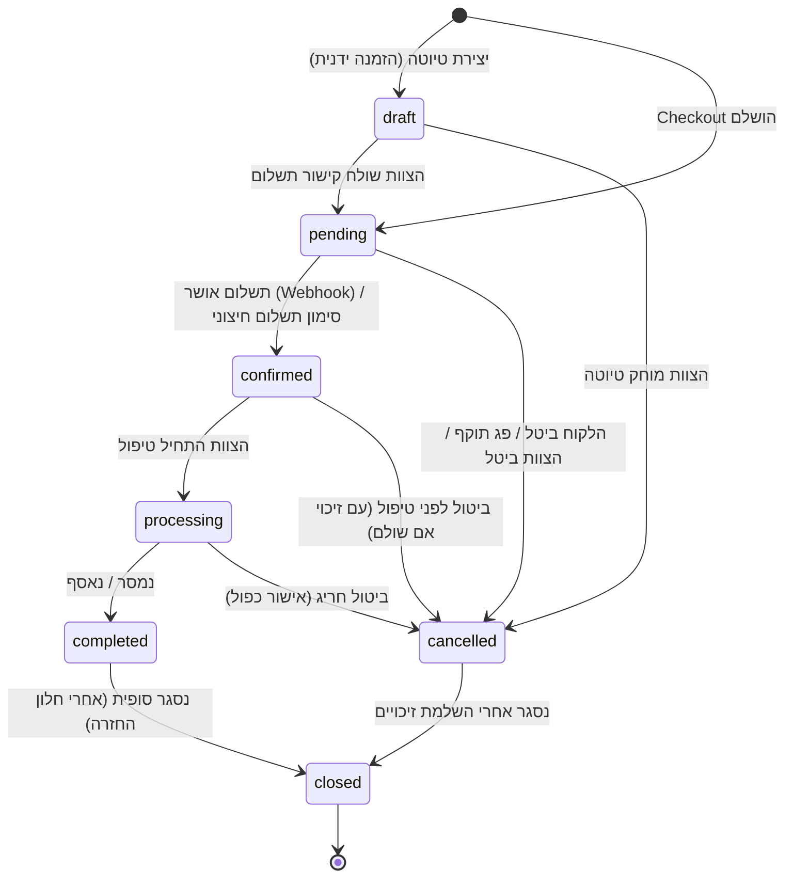

| מעבר | מי רשאי | תיעוד |
|---|---|---|
| →pending | מערכת (Checkout) | `order_created` |
| pending→confirmed | מערכת (Webhook) בלבד; או צוות בהרשאת "סימון תשלום חיצוני" | `payment_succeeded` / `manual_payment_marked` |
| confirmed→processing | צוות ("מטפל בהזמנות"+) | `status_changed` |
| processing→completed | צוות / מערכת (אישור מסירה) | `status_changed` |
| →cancelled | לקוח (רק מ־pending, ותנאי פרק 14); צוות; מערכת (פקיעה) | `cancelled` + סיבה |
| →closed | מערכת (job) / צוות | `status_changed` |

### 1.2 ציר התשלום — `orders.payment_state`

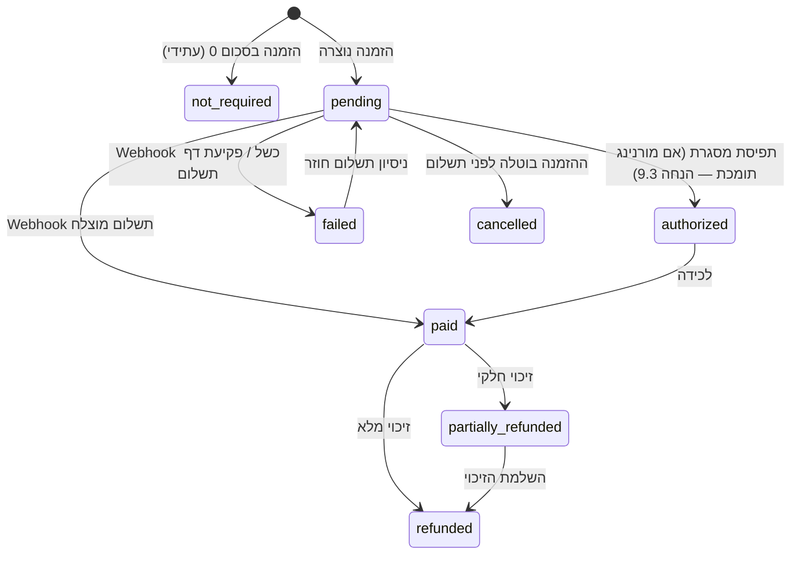

מי רשאי: כל המעברים — **מערכת בלבד** (Webhook/Reconciliation), למעט זיכוי (צוות בהרשאת "זיכוי" → מפעיל את מורנינג → המעבר עצמו נרשם רק אחרי אישור מורנינג) וסימון תשלום חיצוני (צוות, ערוץ טלפוני, הרשאה ייעודית, נתיב `manual_external`).

### 1.3 ציר האספקה — `orders.fulfillment_state`

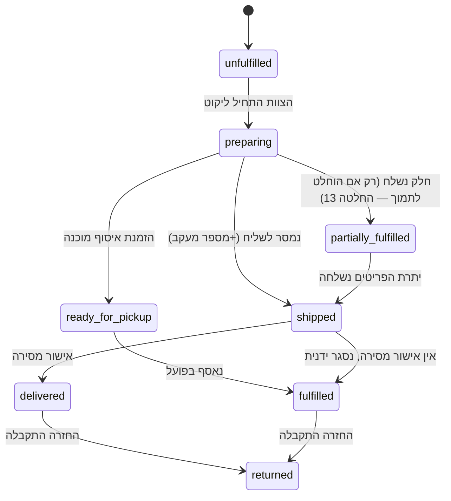

מי רשאי: צוות ("מחסן ומשלוחים"+); `delivered` — גם מערכת (עדכון ספק שילוח, עתידי). כל מעבר שולח הודעת לקוח לפי מטריצת פרק 16 במסמך האב.

### 1.4 ציר המסמך — `orders.document_state`

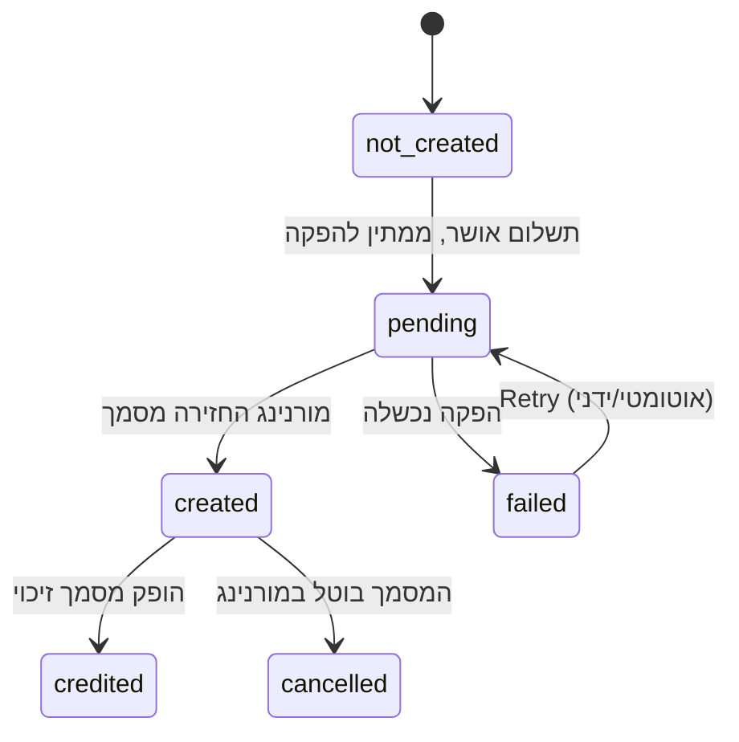

מי רשאי: מערכת; "הפקה מחדש" — צוות בהרשאת "הפקת מסמך מחדש". אם המסמך מופק אוטומטית על־ידי מורנינג בעת הסליקה (תרחיש הבסיס, אימות 9.3.5) — המעבר `not_created→created` מגיע ישירות מה־Webhook.

---

<a name="flow-add-to-cart"></a>
## 2. הוספה לסל

טריגר: כפתור "הוספה לסל" — היום רכיב דומם ללא `onClick` ב־`BookHeroActions.tsx:70-74`, ‏`BookFinalCta.tsx:55-59`; כפתורי הגלילה ב־`StickyNav.tsx:173`, ‏`FloatingActions.tsx:98`; וכפתור חדש בכרטיסי הקטלוג.

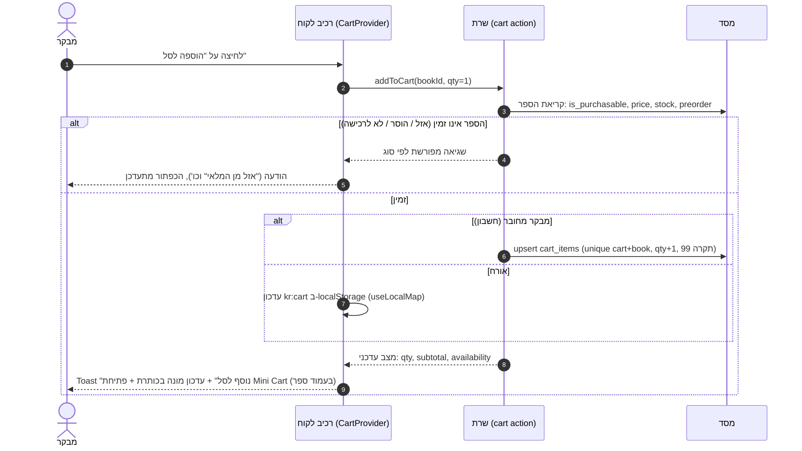

מצבי קצה: כמות מבוקשת > זמין ⇒ ההוספה נחסמת עם הודעה על הכמות המקסימלית; לחיצה כפולה ⇒ ההוספה idempotent־ברמת הכוונה (מונה עולה פעם אחת — debounce בלקוח + upsert בשרת); שתי לשוניות ⇒ סנכרון דרך אירוע `storage` (מנגנון קיים ב־`client-hooks.ts:76-88`).

---

<a name="flow-merge"></a>
## 3. התחברות ומיזוג סל (ורשימות)

```mermaid
sequenceDiagram
    autonumber
    actor U as לקוח
    participant C as לקוח (דפדפן)
    participant S as שרת
    participant DB as מסד

    U->>C: התחברות (OTP) הצליחה
    C->>S: mergeLocalState({cart: kr:cart, favourites: kr:favourites, shelf: kr:shelf, recent: kr:recent-searches})
    S->>DB: טעינת עגלת active של הלקוח
    S->>S: מיזוג עגלה: איחוד ספרים; כמות = max(מקומי, שרת)
    S->>DB: כתיבת עגלה ממוזגת (בטרנזקציה)
    S->>DB: מיזוג saved_books: favourite=OR, ‏shelf=המקומי גובר אם קיים (הבחירה הטרייה)
    S-->>C: תמונת מצב ממוזגת
    C->>C: ריקון kr:cart; ‏kr:favourites/kr:shelf מוחלפים בעותק מהשרת
    C-->>U: מונה סל מעודכן; אין איבוד מידע
```

כללי התנגשות (סעיף 5.8 במסמך האב): לעולם אין מחיקה שקטה — פריט שקיים רק בצד אחד נשמר; התנגשות מדף (ערכים שונים) ⇒ המקומי גובר ונרשם `updated_at`; בהתנתקות — עותק קריאה נשאר מקומי כדי שהחוויה לא "תתרוקן", ומסונכרן מחדש בהתחברות הבאה.

---

<a name="flow-checkout-regular"></a>
## 4. ‏Checkout — המסלול הרגיל (עמוד אחד, שלושה בלוקים)

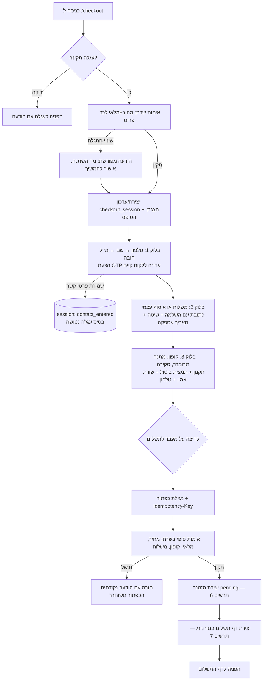

שמירת התקדמות: רענון בכל שלב משחזר מה־session (זיהוי ב־cookie httpOnly). המובייל: סיכום מתקפל בראש; דסקטופ: סיכום דביק בצד. תרומה* — רק כש־`donations_enabled` (מחוץ ל־MVP).

---

<a name="flow-checkout-express"></a>
## 5. ‏Checkout — מסלול אקספרס (Bit / Apple Pay / Google Pay)

מותנה באימות מורנינג 9.3.1 (קביעת אמצעי תשלום מראש דרך ה־API). אם האימות ייכשל — המסלול הופך ל"מעבר מהיר לדף התשלום" (אותו תרשים בלי צעד 4) וההנחה מסומנת.

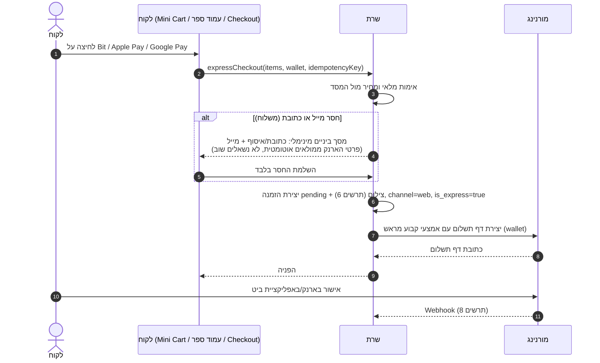

---

<a name="flow-create-order"></a>
## 6. יצירת הזמנה — צילום מלא לפני תשלום

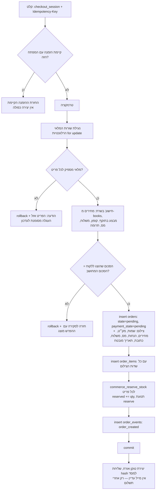

הערה: שמירת המלאי (reserve) ביצירת ההזמנה עם תוקף = `payments.expires_at`; ההחלטה הסופית על מועד השמירה — החלטה 9. ‏`draft` (הזמנה ידנית) עוקף את הצעדים D–J עד שליחת קישור התשלום.

---

<a name="flow-payment-redirect"></a>
## 7. מעבר לסליקה במורנינג

```mermaid
sequenceDiagram
    autonumber
    participant S as שרת
    participant DB as מסד
    participant M as מורנינג (API)
    actor U as לקוח

    S->>DB: insert payments: kind=charge, status=initiated,<br/>idempotency_key, amount=orders.total
    S->>M: יצירת דף תשלום: סכום, פירוט שורות, פרטי לקוח,<br/>סוג מסמך (מהגדרות), success/cancel URLs, מזהה הזמנה,<br/>אמצעי קבוע (אקספרס) / תשלומים מעל סף (אשראי)
    alt הקריאה נכשלה (רשת/API)
        M--xS: שגיאה
        S->>DB: payments.status=failed + error
        S-->>U: הודעה: התשלום לא נפתח, נסו שוב / הזמינו בטלפון<br/>(ההזמנה נשארת pending; ניסיון חוזר יוצר payment חדש)
    else הצליחה
        M-->>S: payment_page_url + מזהה עסקה
        S->>DB: payments: status=pending, morning_transaction_id, page_url
        S-->>U: redirect לדף התשלום של מורנינג
        Note over U,M: הלקוח מזין פרטי תשלום אצל מורנינג בלבד —<br/>פרטי אשראי לעולם אינם עוברים בשרתי האתר
    end
```

---

<a name="flow-webhook"></a>
## 8. קבלת Webhook ממורנינג — מקור האמת לאישור תשלום

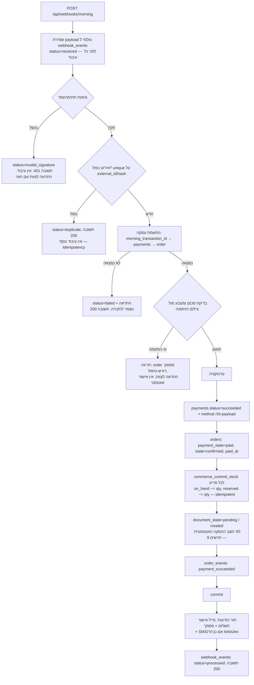

גיבוי ל־Webhook שלא הגיע: ‏job מתוזמן (Polling) שסורק `payments` במצב pending מעל X דקות ושואל את מורנינג לסטטוס יזום (אימות 9.3.7); אותה לוגיקת עיבוד בדיוק, עם `actor_type=system`.

---

<a name="flow-document"></a>
## 9. הפקת מסמך חשבונאי

תרחיש הבסיס (לפי ממצאי 9.1): המסמך מופק **אוטומטית על־ידי מורנינג** עם העסקה, וה־Webhook נושא את פרטיו. התרשים מכסה גם הפקה יזומה (ערוץ טלפוני / Retry).

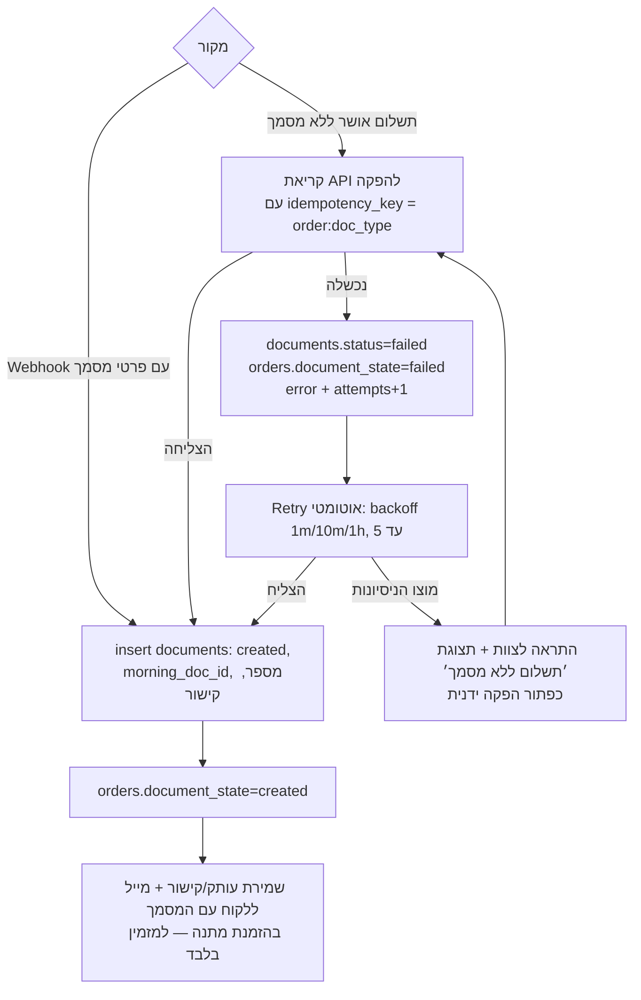

מניעת כפילות: לפני כל קריאת הפקה — בדיקת מסמך חי קיים (partial unique index על `(order_id, doc_type)`); ‏idempotency_key בקריאת ה־API עצמה אם נתמך (אימות 9.3).

---

<a name="flow-inventory"></a>
## 10. הפחתת מלאי אטומית — שני לקוחות על העותק האחרון

```mermaid
sequenceDiagram
    autonumber
    actor A as לקוח א׳
    actor B as לקוח ב׳
    participant S as שרת
    participant DB as מסד (commerce_reserve_stock)

    par שני Checkout במקביל, מלאי available=1
        A->>S: מעבר לתשלום (ספר X)
        B->>S: מעבר לתשלום (ספר X)
    end
    S->>DB: reserve(X,1,orderA) — select for update
    Note over DB: שורת המלאי נעולה; הבקשה השנייה ממתינה
    DB-->>S: הצלחה: reserved=1, available=0
    S->>DB: reserve(X,1,orderB) — הנעילה השתחררה
    DB-->>S: כשל: available=0
    S-->>A: ממשיך למורנינג
    S-->>B: "העותק האחרון נתפס זה עתה" + הצעה:<br/>התראת חזרה למלאי / הסרה מהסל
```

כללי יסוד: אין ערך שלילי (check במסד); כל תנועה נרשמת ב־ledger עם before/after; ‏commit/release בלבד משחררים reserve; ‏reserve שפג תוקפו (תשלום לא הושלם) משוחרר ב־job עם תנועת release.

---

<a name="flow-fulfillment"></a>
## 11. הכנת משלוח

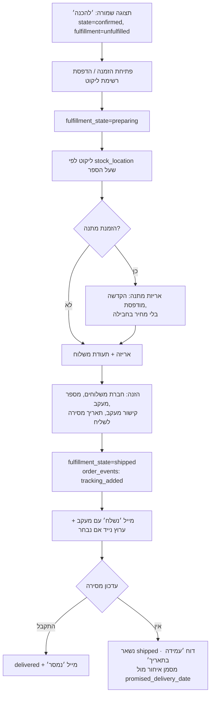

---

<a name="flow-pickup"></a>
## 12. איסוף עצמי

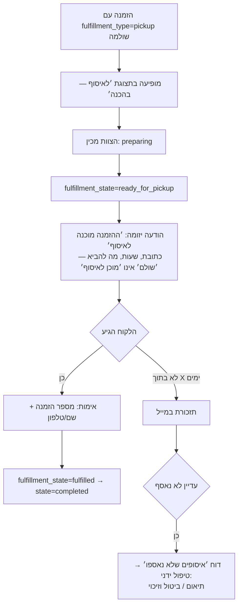

---

<a name="flow-cancel"></a>
## 13. ביטול הזמנה

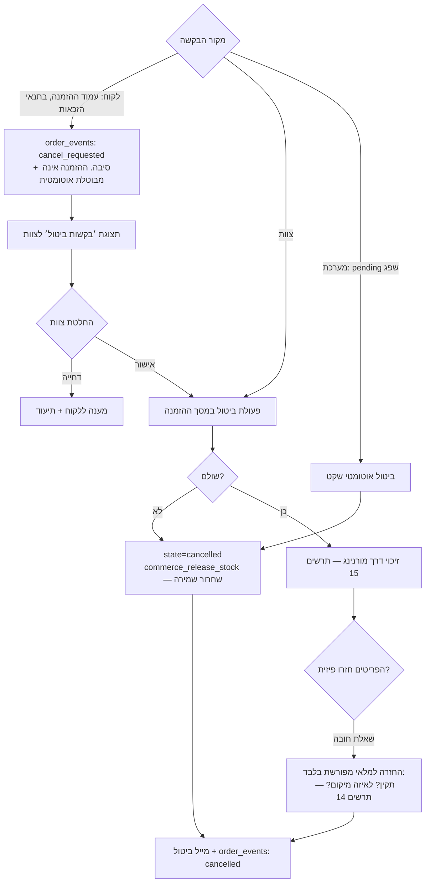

---

<a name="flow-return"></a>
## 14. החזרה (אחרי מסירה)

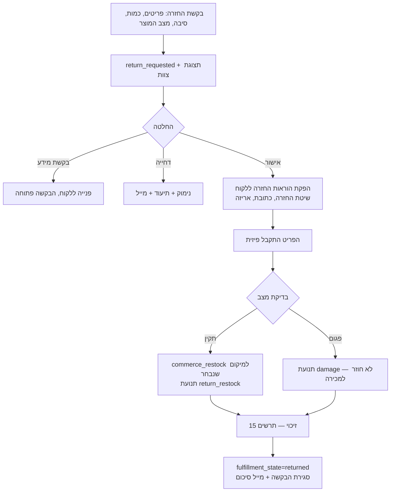

עמידה בדין (סעיף 14.5 במסמך האב): חלונות הביטול, דמי הביטול והחריגים — מהתקנון; המערכת אוכפת את חלון הזכאות בעמוד הלקוח ומציגה את התמצית ליד הכפתור.

---

<a name="flow-refund"></a>
## 15. זיכוי (מלא / חלקי) דרך מורנינג

```mermaid
sequenceDiagram
    autonumber
    actor T as צוות (הרשאת זיכוי)
    participant S as שרת
    participant DB as מסד
    participant M as מורנינג

    T->>S: זיכוי: פריטים/סכום, כולל משלוח או לא, סיבה
    S->>DB: חישוב תקרה: paid − sum(refunds succeeded)
    alt הסכום חורג מהתקרה
        S-->>T: נחסם: ׳זיכוי מצטבר עולה על ששולם׳
    else תקין
        S-->>T: מסך אישור כפול: סכום, אמצעי מקורי (כולל ביט), מסמך זיכוי צפוי
        T->>S: אישור סופי
        S->>DB: insert payments: kind=refund, status=initiated,<br/>parent=החיוב, idempotency_key
        S->>M: בקשת זיכוי על העסקה המקורית
        alt מורנינג אישרה
            M-->>S: אישור + מסמך זיכוי (credit_note)
            S->>DB: refund succeeded; payment_state=partially_refunded/refunded;<br/>documents: credit_note; document_state=credited
            S->>DB: order_events: refund_issued
            S-->>T: הצלחה + קישור למסמך הזיכוי
            S->>S: מייל זיכוי ללקוח
        else נכשלה
            M--xS: שגיאה
            S->>DB: refund failed + error
            S-->>T: כשל מפורט; ניתן לנסות שוב — אין זיכוי כפול (idempotency)
        end
    end
```

זיכוי על עסקת ביט — תהליך/זמנים/מסמך כפופים לאימות 9.3.4; עד אז מסומן כהנחה.

---

<a name="flow-payment-failed"></a>
## 16. תשלום שנכשל

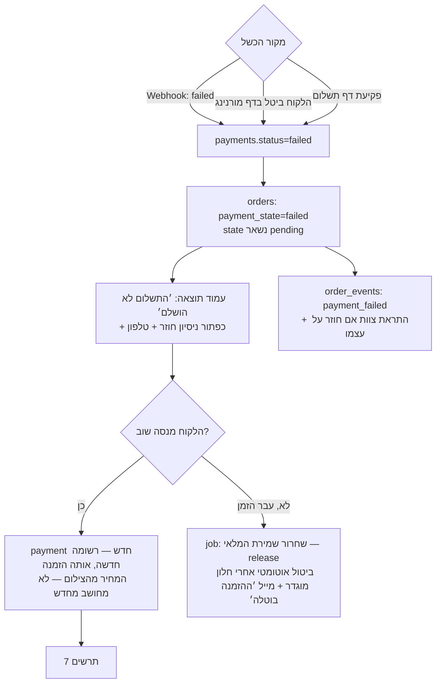

---

<a name="flow-doc-failed"></a>
## 17. תשלום הצליח, מסמך נכשל

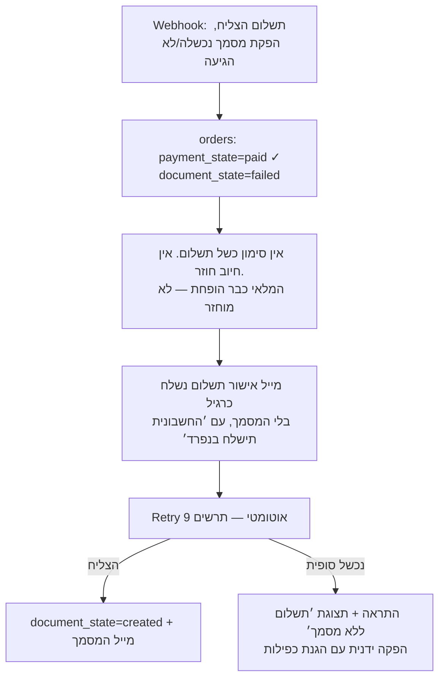

---

<a name="flow-passive-account"></a>
## 18. יצירת חשבון פסיבי לאחר רכישה

```mermaid
sequenceDiagram
    autonumber
    actor U as לקוח (אורח ששילם)
    participant T as עמוד תודה / מייל אישור
    participant S as שרת
    participant A as Supabase Auth
    participant DB as מסד

    T-->>U: ׳שמור את הפרטים לפעם הבאה׳ (הצעה, לא חובה)
    U->>S: לחיצה על ההצעה (טוקן ההזמנה מזהה אותה)
    S->>A: יצירת/איתור משתמש לפי הטלפון + שליחת OTP
    Note over A: בלי kr_staff ⇒ לא נוצר profile צוות (migration 23)
    U->>S: הזנת הקוד
    S->>A: אימות OTP
    A-->>S: session
    S->>DB: insert customers מפרטי ההזמנה (טלפון, שם, מייל)<br/>+ כתובת ההזמנה כ-customer_address ברירת מחדל
    S->>DB: orders.user_id = המשתמש החדש —<br/>לכל ההזמנות התואמות טלפון מאומת זה
    S->>DB: consent_events: terms/channels כפי שסומנו ב-Checkout
    S-->>U: ׳החשבון מוכן׳ + כניסה לאזור האישי<br/>ההזמנה כבר מופיעה בו
```

אין טופס נוסף ואין סיסמה בשום שלב. שיוך הזמנות עבר: רק הזמנות שהטלפון בהן **זהה לטלפון שאומת** ב־OTP — מניעת השתלטות על הזמנות של אחר.

---

<a name="flow-return-before-webhook"></a>
## 19. הלקוח חזר מדף התשלום לפני שה־Webhook הגיע

```mermaid
sequenceDiagram
    autonumber
    actor U as לקוח
    participant R as ‏/checkout/result
    participant S as שרת
    participant M as מורנינג

    U->>R: חזרה מ-success URL
    R->>S: getOrderPaymentState(orderToken)
    S-->>R: payment_state=pending (ה-Webhook טרם הגיע)
    R-->>U: ׳מעבדים את התשלום…׳ — מצב ביניים חיובי, לא שגיאה
    loop רענון כל 3s, עד 60s
        R->>S: בדיקת מצב
        alt Webhook הגיע בינתיים
            S-->>R: paid ⇒ הצגת עמוד התודה המלא
        end
    end
    alt עדיין pending אחרי התקרה
        S->>M: בדיקת סטטוס יזומה (Polling, אימות 9.3.7)
        M-->>S: סטטוס עסקה
        S-->>R: עדכון בהתאם
    end
    alt נשאר לא ידוע
        R-->>U: ׳ההזמנה נקלטה. אישור סופי יישלח למייל בדקות הקרובות׳<br/>+ מספר הזמנה + טלפון. אין חיוב כפול בשום נתיב
    end
```

עיקרון מנחה: **ההפניה חזרה אינה אישור תשלום.** רק Webhook (או Polling מאומת) משנה `payment_state`.
